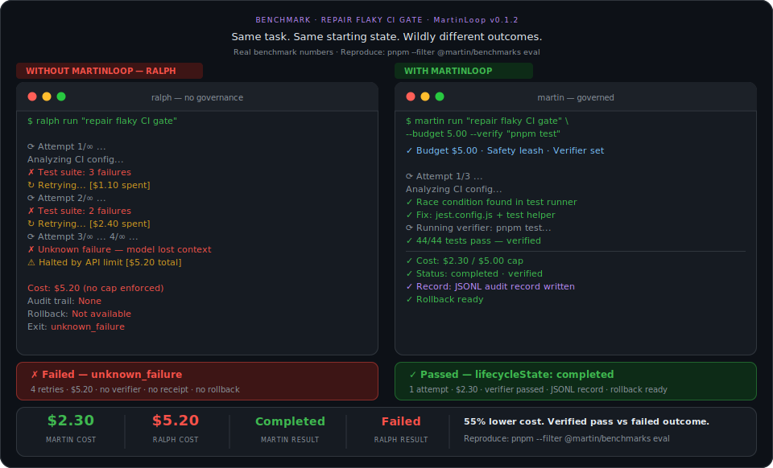
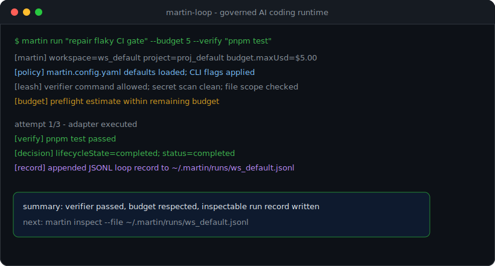

<div align="center">


### A governed runtime for autonomous AI coding agents. ⭐⭐⭐

[](./LICENSE)
[](./tsconfig.base.json)
[](#quick-start)
[](https://www.npmjs.com/package/martin-loop)

<br>

**Your overnight AI pipeline estimated $2.40.**  
**You woke up to a $65 bill.** 
 <br> 47 retries. No hard stop. No rollback. No audit trail. Nothing merged.  
 MartinLoop exists so that never happens again.✅
<br>

> AI coding agents are useful. Unbounded retry loops are not.
>
> MartinLoop wraps agent runs with budgets, policy checks, verifier gates, rollback evidence, and inspectable run records.
<br>


</div>

---

## The Problem

A typical autonomous coding loop keeps attempting work until tests pass. Without a governance layer, that loop can keep spending, mutate files outside the intended scope, lose track of why it failed, and leave teams without a clean audit trail.

MartinLoop calls that failure mode the **Ralph Loop**: attempt ➡️ check ➡️ retry ➡️ repeat, with no strong answer to:

- What changed?
- What did it cost?
- Why was it allowed?
- Why did it stop?
- Can we inspect or resume it later?

---

## The Solution

✅ Martin Loop wraps AI coding loops with a governance layer.

It does not try to replace the agent pattern. It makes that pattern safe to run.

### What MartinLoop Does Today

| Capability | Current behavior |
|---|---|
| Budget governance | Enforces `maxUsd`, `softLimitUsd`, `maxIterations`, and `maxTokens`; rejects attempts projected to exceed remaining budget and exits on budget or iteration exhaustion. Hard USD budget caps that stop work before the next attempt breaches policy. |
| Verifier gate | A run only reaches `completed` when the adapter result and verifier state pass. Unsafe verifier commands are blocked before agent execution. |
| Failure taxonomy | Classifies failures across 11 current classes, including hallucination, test regression, scope creep, repo grounding failure, environment mismatch, and budget pressure, that distinguishes real success from unsafe, invalid, or terminal behavior.|
| Safety leash | Evaluates verifier commands, file scope, dependency or migration changes that require approval, and secret-like values in task text. **Policy-as-code**. |
| Rollback evidence | Captures rollback boundaries and restore outcomes for repo-backed attempts when a persistence store is configured. |
| Context distillation | Carries a distilled summary of recent attempts and remaining constraints into subsequent attempts. |
| Run records | The CLI appends JSONL loop records under `~/.martin/runs/<workspaceId>.jsonl`; lower-level stores can also persist contracts, ledgers, and attempt artifacts.


⭐The result is a runtime that can complete good work, refuse unsafe work, stop uneconomical work, and leave evidence behind.✅
---

## The Ralph Loop, explained

**"Everybody has gotten infatuated with what we call these Ralph Wiggum loops, just like send the thing off and it'll just go figure something out..A, It never figures anything out. And B, you just get this ginormous bill...**" - Chamath Palihapitiya, All-In Podcast #263, March 2026

⛔ The **Ralph Loop** is the failure mode where an AI coding agent keeps trying without knowing when it should stop.⛔

The pattern is simple: attempt the task, run checks, retry on failure, repeat. The problem is not that the loop exists. The problem is that most implementations have no hard budget cap, no signed evidence layer, and no pre-execution control system. They know how to keep trying. They do **not** know when continuing is unsafe, uneconomical, or impossible.

✅ Martin Loop solves the Ralph Loop problem by enforcing rules **before** damage happens:

- it stops the next attempt before budget overspend
- it classifies unsafe or invalid actions before execution
- it records each attempt with cryptographic proof 
- it rolls back failed runs instead of leaving broken state behind 
- it reduces runaway token growth with delta re-prompting 

If Ralph ever burned $165.70 on your dime, you're in the right place. Martin stopped him at $4.97 with a full audit trail. LFG! 🚀 Finally a Martin Prince leash for Ralph Wiggums! :)  

<div align="center">
  
</div>

### How It Works — Five Layers

| Layer | What it does |
|---|---|
| **1. Task Contract** | Objective, verifier plan, repo root, allowed/denied paths, acceptance criteria, workspace, project, and budget. |
| **2. Policy & Budget** | Defaults from `martin.config.yaml`; CLI flags override. Budget preflight rejects attempts before execution. |
| **3. Agent Adapters** | Claude CLI, Codex CLI, direct-provider, and stub adapters normalize execution results into the core runtime contract. |
| **4. Safety & Verification** | Verifier commands, file scope, approval-boundary changes, secret-like values, and grounding determine whether work is kept. |
| **5. Persistence** | CLI writes JSONL records under `~/.martin/runs/`. Repo-backed runs can also persist contracts, ledgers, diffs, and rollback artifacts. |

---

## See It In Action

Same task, same starting state. MartinLoop completes in one verified attempt at `$2.30`. The uncontrolled loop retries four times, spends `$5.20`, and fails with no audit trail.

Martin Loop matters because it turns AI coding from an opaque experiment into something that can be governed, replayed, verified, and trusted.

<div align="center">
  
</div>


Reproducible locally:

```sh
pnpm --filter @martin/benchmarks test
pnpm --filter @martin/benchmarks eval
pnpm --filter @martin/benchmarks eval:phase12
```

---

## Quick Start

```sh
npm install -g martin-loop
```

This installs both the `martin-loop` package and the `martin` command alias. The package is currently published on npm as version `0.1.2`.

### Run a governed task

```sh
martin run "fix the auth regression" \
  --budget 3.00 \
  --verify "pnpm test"
```

You can also pass the objective explicitly:

```sh
martin run --objective "fix the auth regression" --budget 3.00 --verify "pnpm test"
```

For a no-spend repo-local dry run, use the stub adapter:

```powershell
$env:MARTIN_LIVE='false'
pnpm run:cli -- run --objective "Summarize the current runtime state" --verify "pnpm --filter @martin/core test"
Remove-Item Env:MARTIN_LIVE
```

### Inspect or resume runs

```sh
martin inspect --file ~/.martin/runs/<workspaceId>.jsonl
martin resume <loopId>
```

`inspect` prints a portfolio summary for records in the file. `resume` looks up a persisted loop record by ID under `~/.martin/runs/`.

---

## CLI

```text
martin run <objective> [options]

  --objective <text>      The task to accomplish, or pass it as the first positional arg
  --budget <n>            Hard cost cap in USD
  --budget-usd <n>        Alias for --budget
  --soft-limit-usd <n>    Soft budget threshold in USD
  --verify <cmd>          Verifier command after each attempt
  --max-iterations <n>    Maximum number of attempts
  --max-tokens <n>        Maximum total token budget
  --engine <name>         Adapter to use: claude (default) or codex
  --model <name>          Override the adapter model
  --cwd <path>            Repo root for the run
  --allow-path <glob>     Restrict agent writes to this path pattern; repeatable
  --deny-path <glob>      Block this path pattern; repeatable
  --accept <criterion>    Add an acceptance criterion; repeatable
  --config <path>         Path to a martin.config.yaml file
  --workspace <id>        Workspace ID for the run record
  --project <id>          Project ID for the run record
  --metadata <key=value>  Attach metadata to the run record; repeatable
```

The public CLI also includes `inspect`, `resume`, and a `bench` redirect that points reviewers to the workspace benchmark harness.

<div align="center">
  
</div>

---

## Policy File

Drop a `martin.config.yaml` in your repo root to set governance defaults:

```yaml
budget:
  maxUsd: 5.00
  softLimitUsd: 3.75
  maxIterations: 5
  maxTokens: 40000

governance:
  destructiveActionPolicy: approval
  telemetryDestination: local-only
  verifierRules:
    - pnpm test
```

CLI flags override config values when provided.

---

## TypeScript SDK

```sh
npm install martin-loop
```

```typescript
import {
  MartinLoop,
  createClaudeCliAdapter,
  createCodexCliAdapter,
  runMartin
} from "martin-loop";

const loop = new MartinLoop({
  adapter: createClaudeCliAdapter({ workingDirectory: process.cwd() }),
  defaults: {
    workspaceId: "my-workspace",
    projectId: "my-project",
    budget: {
      maxUsd: 3.00,
      softLimitUsd: 2.25,
      maxIterations: 3,
      maxTokens: 20_000
    }
  }
});

const result = await loop.run({
  task: {
    title: "Fix auth regression",
    objective: "Fix the failing auth regression tests",
    verificationPlan: ["pnpm test"],
    repoRoot: process.cwd()
  }
});

console.log(result.decision.status);
```

Use Codex instead of Claude by swapping adapters:

```typescript
const loop = new MartinLoop({
  adapter: createCodexCliAdapter({ workingDirectory: process.cwd() })
});
```

The lower-level `runMartin` function is also exported for callers that want to assemble the runtime input directly.

---

## Workspace Map

| Package or app | Role |
|---|---|
| `martin-loop` | Root public npm facade that vendors the runtime, CLI, adapters, and contracts into `dist/`. |
| `@martin/contracts` | Shared types for loops, policy, governance, budget, telemetry, and rollback. |
| `@martin/core` | Runtime controller, policy engine, safety leash, grounding, persistence, and rollback logic. |
| `@martin/adapters` | Claude CLI, Codex CLI, direct-provider, and stub adapter surfaces. |
| `@martin/cli` | Local CLI implementation for `run`, `inspect`, `resume`, and the benchmark redirect. |
| `@martin/mcp` | MCP server tools: `martin_run`, `martin_inspect`, and `martin_status`. |
| `benchmarks/` | Workspace-only deterministic benchmark and RC validation harness. |
| `apps/control-plane/` | Hosted control-plane workstream, outside the initial npm package surface. |
| `apps/local-dashboard/` | Local dashboard/read-model viewer, not currently packaged as public npm API. |

The `@martin/core`, `@martin/adapters`, and `@martin/contracts` package manifests are still private workspace packages; the public install target is the root `martin-loop` facade.

---

## Development

Requirements: Node 20+ and pnpm 10.x.

```sh
git clone https://github.com/Keesan12/MartinLoop
cd MartinLoop/martin-loop
pnpm install

pnpm test
pnpm lint
pnpm build
```

Current RC gate commands:

```sh
pnpm oss:validate
pnpm public:smoke
pnpm repo:smoke
pnpm rc:validate
pnpm pilot:prep:validate
pnpm release:matrix:local
```

The repository is organized as a dual-track workspace: the OSS runtime and package facade are present and published, while the hosted control-plane, local dashboard, and benchmark harness remain repo/workspace surfaces rather than the primary npm package API.

Helpful docs:

- [OSS quickstart](./docs/oss/QUICKSTART.md)
- [OSS examples](./docs/oss/EXAMPLES.md)
- [OSS boundary report](./docs/oss/OSS-BOUNDARY-REPORT.md)
- [Release surface report](./docs/oss/RELEASE-SURFACE-REPORT.md)

---

## Contributing

```sh
git checkout -b feat/your-feature
pnpm lint
pnpm test
git commit -m "feat: describe what you built"
git push -u origin feat/your-feature
```

Conventional commit prefixes: `feat:`, `fix:`, `chore:`, `docs:`, `refactor:`, and `test:`.

---

<div align="center">

**Give the repo a star** if you think AI coding needs budgets, brakes, and receipts.

**MIT Licensed** · [martinloop.com](https://martinloop.com) · [keesan@martinloop.com](mailto:keesan@martinloop.com)

*"AI coding accountability: completes good work, refuses unsafe work, stops uneconomical work."*

</div>
