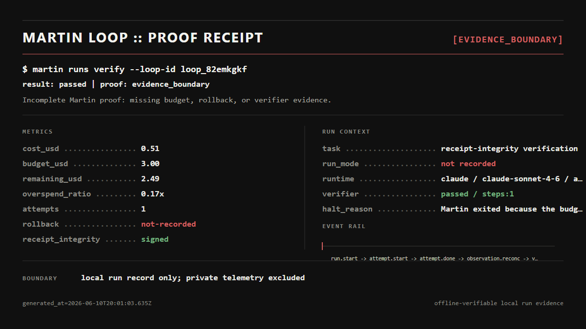

# MartinLoop

Your coding agent says it's done. MartinLoop makes it prove it.

One system to control, verify and understand coding-agent work.

<div align="center">
  

  **MartinLoop gives AI coding agents budgets, stop conditions, rollback rules, and receipts.**

  Built from thousands of agent runs where the problem was not intelligence -- it was uncontrolled execution.

  **Get started:** `npx -y martin-loop@latest start`  
  **Try the demo:** `npx -y martin-loop@latest demo`

  [](./LICENSE)
  [](./tsconfig.base.json)
  [](#quick-start)
  [](https://www.npmjs.com/package/martin-loop)
  [](https://www.npmjs.com/package/martin-loop)

  MartinLoop is part of the NVIDIA Inception program.
  <br>
  <picture>
    <source media="(prefers-color-scheme: dark)" srcset="./docs/assets/nvidia-inception-program.png">
    
  </picture>
</div>

## Start Here

**Install** — run `npx -y martin-loop@0.5.0 start`, or install it globally with `npm install -g martin-loop@0.5.0`.

**Governed run** — define an objective, verifier, budget, and iteration cap with `martin run`.

**Verifier** — completion requires fresh verifier evidence bound to the active run and workspace. A configured verifier proves only the checks it runs; `VERIFIED` is not a claim that the code is bug-free or automatically safe to merge.

**Budget** — set a hard spend ceiling with `--budget-usd` and an attempt ceiling with `--max-iterations`.

**Receipts** — inspect the latest result with `martin dossier --latest` and validate stored integrity with `martin runs verify --latest`.

**MCP** — install `@martinloop/mcp@0.5.0` in a supported host or generate host configuration with `martin mcp print-config`.

**Documentation** — continue with the [quickstart](./docs/getting-started/quickstart.md), [CLI reference](./docs/reference/cli.md), or [MCP setup](./docs/getting-started/mcp.md).

When `--model` is provided, MartinLoop passes it through unchanged. Without `--model`, the authenticated host runtime chooses its own default. MartinLoop does not inject a hidden fallback model.

## Why MartinLoop

AI coding agents are useful, but unbounded retry loops are expensive.

A task that looked like a small fix can become dozens of attempts, a blown token budget, and a diff nobody trusts. MartinLoop gives every run an explicit contract: objective, verifier, budget, scope, receipts, and a clear stop condition.

Use it when AI coding work needs to stay bounded, inspectable, and safe to review before it becomes expensive or destructive.

## Why Teams Adopt MartinLoop

- It turns agent behavior into inspectable run receipts you can actually review.
- It enforces hard stop conditions before runaway retries spend more money.
- It adds rollback-aware rules so failed attempts do not silently leave unsafe changes behind.
- It helps teams compare outcomes across agents under one governed flow.

Teams use MartinLoop when they need governed agent execution that can be reviewed and trusted.

## 2-Minute Install Path

```sh
npx -y martin-loop@latest start
npx -y martin-loop@latest demo
cd martin-loop-demo
npm install
npx -y martin-loop@latest run "Summarize the demo workspace and prove tests still pass" --verify "npm test" --budget-usd 2 --max-iterations 1
```

## Quick Start

Try MartinLoop in a disposable demo workspace:

```sh
npx -y martin-loop@latest start
npx -y martin-loop@latest demo
npx -y martin-loop@latest --version
cd martin-loop-demo
npm install
npx -y martin-loop@latest run "Summarize the demo workspace and prove tests still pass" --verify "npm test" --budget-usd 2 --max-iterations 1
npx -y martin-loop@latest dossier --latest
npx -y martin-loop@latest share --latest
```

Optional global install:

```sh
npm install -g martin-loop
martin-loop --version
```

If this flow is useful, open an issue with feedback so we can keep improving the public experience.

`start` prints the first-run guided path. `run` auto-checks `doctor`, `session-start`, and `preflight`, then executes when the environment is ready. Use `--proof` only when you intentionally want an explicit no-spend lane.

Inspect-first flow:

```sh
npx -y martin-loop@latest doctor
npx -y martin-loop@latest session-start
npx -y martin-loop@latest preflight "Summarize the demo workspace and prove tests still pass" --verify "npm test"
```

`share --latest` writes three files into the selected run directory under `share/`: `run-receipt.json`, `run-receipt.md`, and `proof-card.svg`.

Release notes for the current root package: [MartinLoop 0.5.0](./docs/release/OSS-0.5.0-RELEASE-NOTES.md).

## Visual Proof

MartinLoop turns an AI coding run into an inspectable execution record: budget used, verifier result, changed files, rollback evidence, and final receipt.

<div align="center">
  
</div>

Ungoverned agents can retry until cost and scope drift. MartinLoop adds budget caps, verifier gates, and audit evidence so the run has a clear stop condition.

<div align="center">
  
</div>

## Proof Receipts

Proof receipts are local share bundles for governed AI coding runs. They show the task, spend, budget, verifier result, receipt integrity, and any evidence boundary that should not be rounded into confidence.

This real governed run spent `$0.51` against a `$3.00` budget. The verifier passed and the receipt integrity was signed, but the proof stayed at `EVIDENCE_BOUNDARY` because rollback evidence was not recorded.

<div align="center">
  
</div>

Generate your own receipt after a governed run:

```sh
npx -y martin-loop@latest run "Summarize the demo workspace and prove tests still pass" --proof --verify "npm test"
npx -y martin-loop@latest runs verify --latest
npx -y martin-loop@latest share --latest
```

Example receipt files: [Markdown](./docs/examples/proof-receipts/live-governed-run-receipt.md) and [JSON](./docs/examples/proof-receipts/live-governed-run-receipt.json).

## Run This Audit Yourself

Use this lane from a clean temp directory to verify the public CLI flow exactly as shipped:

```sh
npx -y martin-loop@0.5.0 --version
npx -y martin-loop@0.5.0 start
npx -y martin-loop@0.5.0 demo
cd martin-loop-demo
npm install
npx -y martin-loop@0.5.0 run "Summarize the demo workspace and prove tests still pass" --verify "npm test" --budget-usd 2 --max-iterations 1 --json
npx -y martin-loop@0.5.0 dossier --latest --json
npx -y martin-loop@0.5.0 share --latest --json
```

For deterministic installs, pin the package line (`martin-loop@0.5.0`) or use `martin-loop@latest`. Plain `npx martin-loop` can resolve a stale local cache on some machines.

Expected share bundle outputs:

- `share/run-receipt.json`
- `share/run-receipt.md`
- `share/proof-card.svg`

## See It In Action

The point is not that every governed run is always cheaper. The point is that every run becomes inspectable and enforceable: budget policy, verifier result, stop reason, and evidence are explicit.

For a deterministic public repro lane, use the benchmark workspace and compare governed execution to unbounded retry behavior:

- `npx martin-loop bench --suite under-3-challenge`
- `npx martin-loop bench --suite ralphy-engineering-50`

## Ralph-Style Loops

A Ralph-style loop is the failure mode where an AI coding agent keeps trying without knowing when continuing is unsafe, uneconomical, or unlikely to succeed.

MartinLoop keeps the useful part of the loop, then adds brakes:

- stop before budget overspend
- classify unsafe or invalid actions before execution
- write an audit record for every attempt
- preserve rollback and verifier evidence for review
- reduce runaway context growth with compact run summaries

## Failure Taxonomy (13 Runtime Classes)

Public governed runs use one canonical taxonomy: the 13 runtime `FailureClass` values from `@martin/contracts`.

See the canonical table: [Failure Taxonomy (13 Runtime Classes)](./docs/oss/FAILURE-TAXONOMY-13.md).

## What It Does

- Budget caps stop the next attempt before a configured USD, token, or iteration limit is exceeded.
- Verifier gates require a real check, such as `npm test`, before a run can count as complete.
- Policy checks block unsafe verifier commands, risky path changes, and secret-like task inputs before execution.
- Failure classification uses canonical runtime classes for triage and reporting. See [Failure Taxonomy (13 Runtime Classes)](./docs/oss/FAILURE-TAXONOMY-13.md).
- Run receipts capture stop reason, verifier evidence, budget posture, integrity state, and the next safe action.
- `martin share --latest` turns the latest governed run into a local share bundle with a redacted JSON receipt, Markdown recap, and proof-card SVG.
- MCP integration gives hosts one write-capable execution entrypoint plus richer planning, inspection, and review helpers.

## How It Works

| Layer | Purpose |
| --- | --- |
| Task contract | Objective, verifier plan, repo root, allowed paths, denied paths, acceptance criteria, workspace, project, and budget. |
| Policy and budget | Defaults come from `martin.config.yaml`; CLI flags can override them. Budget preflight blocks attempts that would exceed policy. |
| Agent adapters | Claude CLI, Codex CLI, Gemini CLI, and direct-provider adapters normalize execution results. |
| Safety and verification | Scope checks, verifier command checks, prompt integrity, and grounding decide whether work can continue. |
| Persistence | JSONL run records, evidence summaries, and repo-backed artifacts make every run inspectable later. Each loop record is locally signed (HMAC, per-runs-root key) and `dossier`/`runs get`/`runs verify`/`challenge`/`badge` report an `integrity` verdict (`verified` / `tamper_detected` / `unsigned`) so post-hoc edits to a record are detectable, not just inspectable. |

## Trust Boundaries

- Cost and token outputs always include provenance (`actual`, `calculated`, `estimated`, or `unavailable`).
- For Codex specifically, MartinLoop reports authoritative usage only when the host exposes it; otherwise MartinLoop labels usage as estimated and avoids presenting it as settled accounting.
- Receipt integrity must be `verified` before a run is treated as trustworthy evidence for external review.

## CLI

```text
martin-loop doctor
martin-loop demo
martin-loop session-start [--host <claude|codex|gemini|generic>]
martin-loop phase status|contract|session-start|preflight|run [--execute]
martin-loop preflight <objective> [options]
martin-loop run <objective> [options]
martin-loop bench --suite <suiteId>
martin-loop triage
martin-loop dossier (--latest | --loop-id <id> | --file <path>)
martin-loop runs list|get|attempt|verify ...
martin-loop mcp print-config --host <codex|claude|gemini|cursor|vscode|generic>
martin-loop mcp install --host <codex|claude|gemini|cursor|vscode|generic>
martin-loop mcp verify-install --host <name> [--scope <user|project|local>]
martin-loop mcp rollback --host <name> [--scope <user|project|local>]
martin-loop mcp uninstall --host <name> [--scope <user|project|local>]
martin-loop challenge [--loop-id <id> | --file <path> | --latest]
martin-loop share (--loop-id <id> | --file <path> | --latest) [--out-dir <path>]
martin-loop badge [--format svg|json] [--runs-dir <path>]
```

<!-- Generated by scripts/generate-install-links.mjs. -->
<!-- MCP package: @martinloop/mcp@0.3.5 -->

[](vscode:mcp/install?%7B%22name%22%3A%22martin-loop%22%2C%22command%22%3A%22npx%22%2C%22args%22%3A%5B%22-y%22%2C%22%40martinloop%2Fmcp%400.3.5%22%5D%7D)
[](cursor://anysphere.cursor-deeplink/mcp/install?name=martin-loop&config=eyJjb21tYW5kIjoibnB4IiwiYXJncyI6WyIteSIsIkBtYXJ0aW5sb29wL21jcEAwLjMuNSJdfQ%3D%3D)

Common options:

```text
--budget <n>            Hard cost cap in USD
--budget-usd <n>        Alias for --budget
--soft-limit-usd <n>    Soft budget threshold in USD
--verify <cmd>          Verifier command after each attempt
--proof                 Run verifier-only evidence checks without claiming governed execution
--max-iterations <n>    Maximum number of attempts
--max-tokens <n>        Maximum token budget
--engine <name>         Adapter to use: claude, codex, gemini, or openai
--cwd <path>            Repo root for the run
--allow-path <glob>     Restrict writes to this path pattern; repeatable
--deny-path <glob>      Block this path pattern; repeatable
--runs-dir <path>       Override the local Martin runs root
```

Examples below use `npx martin-loop` so they work without a global install. If you install `martin-loop` globally, the `martin` alias works too.

Use `martin-loop share --latest` after `dossier` when you want a redacted bundle you can hand to another person without sending raw run-store files.

More detail: [CLI reference](./docs/reference/cli.md) and [configuration reference](./docs/reference/config.md).

<div align="center">
  
</div>

## Benchmarks

MartinLoop ships a public deterministic benchmark workspace in `benchmarks/` plus the installed-package `bench` command.

From an installed package:

```sh
npx martin-loop bench --suite under-3-challenge
npx martin-loop bench --suite ralphy-engineering-50
```

From a clean public clone:

```sh
pnpm install --frozen-lockfile
pnpm bench:build
pnpm bench:eval
pnpm bench:report:ralphy
```

Equivalent workspace-filter commands:

```sh
pnpm --filter @martin/benchmarks build
pnpm --filter @martin/benchmarks test
pnpm --filter @martin/benchmarks eval
pnpm --filter @martin/benchmarks report:ralphy
```

The installed-package command reads the shipped public fixtures. The repo-clone workflow runs the public benchmark workspace directly.

## MCP

Run the standalone MCP package directly:

```sh
npx -y @martinloop/mcp
```

Add it to common hosts:

```sh
codex mcp add martin-loop -- npx -y @martinloop/mcp
claude mcp add --transport stdio --scope user martin-loop -- npx -y @martinloop/mcp
claude mcp add --transport stdio --scope user martin-loop -- cmd /c npx -y @martinloop/mcp
```

Generate host config from the root CLI:

```sh
npx martin-loop mcp print-config --host codex --transport stdio --profile minimal
npx martin-loop mcp print-config --host claude --transport stdio --profile diagnostic
npx martin-loop mcp print-config --host gemini --transport stdio --profile full-local
npx martin-loop mcp print-config --host generic --transport stdio --profile github-review
```

The root `martin-loop` package and the standalone `@martinloop/mcp` package are both advancing to `0.5.0` in this release. Their version lines may move independently in future releases.

The public MCP release train labels are:

- `0.1.4` operator foundation
- `0.2.0` cockpit expansion
- `0.2.5` public MCP package line
- `0.2.7` usability and review release
- `0.3.0` host adoption and onboarding release
- `0.3.1` review and handoff release

The standalone MCP registry/server identifier is `io.github.Keesan12/martin-loop`.

More detail: [MCP setup](./docs/getting-started/mcp.md), [MCP tool reference](./docs/reference/mcp-tools.md), and [MCP compatibility](./docs/reference/mcp-compatibility.md).

## SDK

```sh
npm install martin-loop
```

```typescript
import { MartinLoop, createClaudeCliAdapter } from "martin-loop";

const loop = new MartinLoop({
  adapter: createClaudeCliAdapter({ workingDirectory: process.cwd() }),
  defaults: {
    workspaceId: "my-workspace",
    projectId: "my-project",
    budget: {
      maxUsd: 3,
      softLimitUsd: 2.25,
      maxIterations: 3,
      maxTokens: 20_000,
    },
  },
});

const result = await loop.run({
  task: {
    title: "Fix auth regression",
    objective: "Fix the failing auth regression tests",
    verificationPlan: ["pnpm test"],
    repoRoot: process.cwd(),
  },
});

console.log(result.decision.status);
```

The root SDK also exports `createCodexCliAdapter`, `createGeminiCliAdapter`, `createDirectProviderAdapter`, and `createOpenAiCompatibleAdapter`.

More detail: [SDK reference](./docs/reference/sdk.md) and [package map](./docs/reference/packages.md).

## Examples

- [Quickstart](./docs/getting-started/quickstart.md)
- [Examples](./docs/getting-started/examples.md)
- [Agent Failure Atlas](./docs/agent-failure-atlas.md)
- [Failure Taxonomy (13 Runtime Classes)](./docs/oss/FAILURE-TAXONOMY-13.md)
- [PRE-028-PUBLIC-SURFACE-DIFF.md](./docs/oss/PRE-028-PUBLIC-SURFACE-DIFF.md)
- [Claude Code walkthrough](./docs/getting-started/claude-code.md)
- [Codex setup](./docs/getting-started/codex.md)
- [MCP setup](./docs/getting-started/mcp.md)
- [MCP tool reference](./docs/reference/mcp-tools.md)
- [Agent run receipts](./docs/oss/AGENT-RUN-RECEIPTS.md)
- [Benchmark + receipt page](./docs/oss/BENCHMARK-RECEIPT-PAGE.md)
- [GitHub Actions budget gate](./examples/github-actions-budget-gate/)
- [OpenCode-style adapter](./examples/opencode-adapter/)

## Development

Requirements:

- Node.js 20+
- pnpm 10.x

```sh
git clone https://github.com/Keesan12/martin-loop.git
cd martin-loop
pnpm install --frozen-lockfile
pnpm lint
pnpm test
pnpm build
pnpm public:copy-scan
pnpm public:git-surface
pnpm oss:validate
pnpm public:smoke
pnpm release:matrix:local
```

Standalone MCP validation:

```sh
pnpm --filter @martinloop/mcp lint
pnpm --filter @martinloop/mcp test
pnpm --filter @martinloop/mcp build
pnpm --filter @martinloop/mcp smoke:pack
pnpm --filter @martinloop/mcp smoke:published:pack
pnpm --filter @martinloop/mcp verify:release
```

## Contributing

Issues, bug reports, workflow feedback, and focused pull requests are welcome. Public-facing docs should stay concise, user-centered, and accurate.

```sh
git checkout -b feat/your-feature
pnpm lint
pnpm test
git commit -m "feat: describe what you built"
git push -u origin feat/your-feature
```

<p align="center">
  <strong>Star this repo</strong> if you think AI coding needs budgets, brakes, and receipts.
</p>
<p align="center">
  <a href="https://martinloop.com">martinloop.com</a> · <a href="mailto:support@martinloop.com">support@martinloop.com</a>
</p>
<p align="center">
  MartinLoop is part of the NVIDIA Inception program.
</p>
<p align="center">
  <picture>
    <source media="(prefers-color-scheme: dark)" srcset="./docs/assets/nvidia-inception-program.png">
    
  </picture>
</p>

## Telemetry & Privacy

MartinLoop sends minimal anonymous usage data to help improve reliability and prioritize development. A first-run notice appears before any data is transmitted. No data is sent on that first run.

**What is sent:**
- Random installation ID (generated locally, never linked to your identity)
- Per-process session ID
- CLI version, Node version, OS and architecture
- Event name and timestamp
- Command category, run duration, success/failure category
- Whether a receipt was generated; whether recovery occurred
- Opaque remote-experience ID/type after a click

**What is never sent:**
- Source code, prompts, task text, repository contents, file names, file paths
- Environment variables, secrets, provider/model output
- Receipt contents, ledger contents, approval details, verifier evidence
- Email addresses, workspace, project, or organization identifiers
- Raw exception messages or stack traces

**Endpoint:** `https://tupopqvqnyyjuxseyxkr.supabase.co/functions/v1/product-events`

**Headers sent:** `Content-Type: application/json`, `User-Agent: MartinLoop-CLI/<version>`

No authorization header, API key, or direct table access.

**Opt out anytime:**
```
martin telemetry off
```

**Inspect what is sent:**
```
martin telemetry explain
```

**Environment variables that disable telemetry:** `MARTIN_TELEMETRY_DISABLED=1`, `DO_NOT_TRACK=1`, `CI=1`

MartinLoop continues to work normally with telemetry disabled. No features are gated on telemetry consent.

## License

Apache-2.0. See [LICENSE](./LICENSE).
