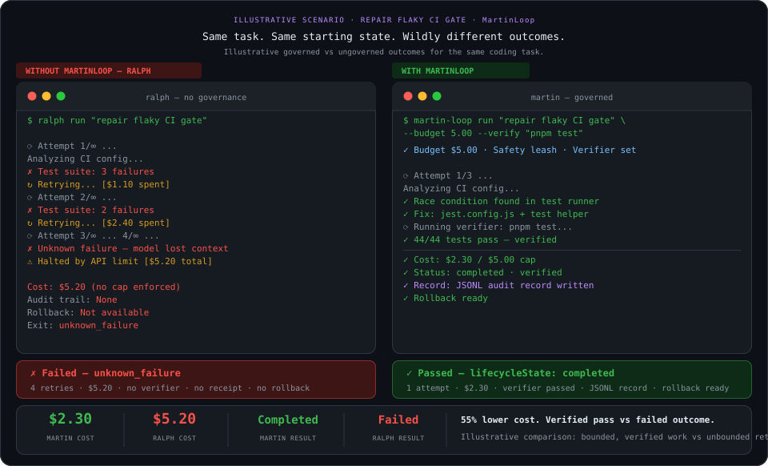
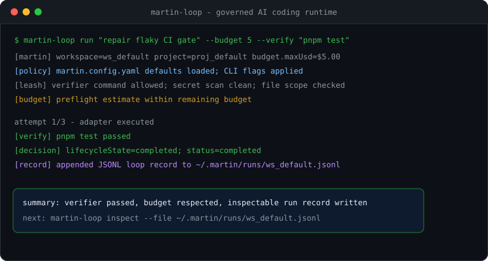

<div align="center">


### The cross agent governance layer for autonomous AI coding agents.⭐

[](./LICENSE)
[](./tsconfig.base.json)
[](#quick-start)
[](https://www.npmjs.com/package/martin-loop)

MartinLoop has been accepted into the NVIDIA Inception program.

<br>

**Your overnight AI pipeline estimated $2.40.**  
**You woke up to a $65 bill.** 
 <br> 47 retries. No hard stop. No rollback. No audit trail. Nothing merged.  
 MartinLoop exists so that never happens again.✅ <br> <br>
 If you think autonomous AI coding agents need budgets, brakes, and receipts, please star ⭐ the repo so more builders can find it.
<br>

> AI coding agents are useful. Unbounded retry loops are not.
>
> MartinLoop wraps agent runs with budgets, policy checks, verifier gates, rollback evidence, and inspectable run records. Built for Enterprise Coding Agents, Agentic Teams, and Autonomous Companies. 
<br>


</div>

---

## The Problem

A typical autonomous coding loop keeps attempting work until tests pass. Without a governance layer, that loop can keep spending, mutate files outside the intended scope, lose track of why it failed, and leave teams without a clean audit trail.

Ralph-style loops are powerful but they attempt ➡️ check ➡️ retry ➡️ repeat, with no strong answer to:

- What changed?
- What did it cost?
- Why was it allowed?
- Why did it stop?
- Can we inspect or resume it later?

MartinLoop governs the failure mode.

---

## The Solution

✅ Martin Loop wraps AI coding loops with a governance layer.

It does not try to replace the agent pattern. It makes that pattern safe to run.

### What MartinLoop Does Today

| Capability | Current behavior |
|---|---|
| Budget governance | Enforces `maxUsd`, `softLimitUsd`, `maxIterations`, and `maxTokens`; rejects attempts projected to exceed remaining budget and exits on budget or iteration exhaustion. Hard USD budget caps that stop work before the next attempt breaches policy. |
| Verifier gate | A run only reaches `completed` when the adapter result and verifier state pass. Unsafe verifier commands are blocked before agent execution. |
| Failure taxonomy | Classifies failures across 11 current classes, including hallucination, test regression, scope creep, repo grounding failure, environment mismatch, and budget pressure, that distinguishes real success from unsafe, invalid, or terminal behavior.|
| Safety leash | Evaluates verifier commands, file scope, dependency or migration changes that require approval, and secret-like values in task text. **Policy-as-code**. |
| Context integrity | Scans user prompts and tool output for injection patterns (authority inversion, instruction override, identity redefinition) before any attempt is admitted. Aborts with human escalation on detection. |
| Rollback evidence | Captures rollback boundaries and restore outcomes for repo-backed attempts when a persistence store is configured. |
| Context distillation | Carries a distilled summary of recent attempts and remaining constraints into subsequent attempts. |
| Run records | The CLI appends JSONL loop records under `~/.martin/runs/<workspaceId>.jsonl`; lower-level stores can also persist contracts, ledgers, and attempt artifacts.


⭐The result is a runtime that can complete good work, refuse unsafe work, stop uneconomical work, and leave evidence behind.✅
---

## Ralph-Style Loops Need a Control Layer

**"Everybody has gotten infatuated with what we call these Ralph Wiggum loops, just like send the thing off and it'll just go figure something out..A, It never figures anything out. And B, you just get this ginormous bill...**" - Chamath Palihapitiya, All-In Podcast #263, March 2026

⛔ The **Ralph Loop** is the failure mode where an AI coding agent keeps trying without knowing when it should stop.

The pattern is simple: attempt the task, run checks, retry on failure, repeat. The problem is not that the loop exists. The problem is that most implementations have no hard budget cap, no signed evidence layer, and no pre-execution control system. They know how to keep trying. They do **not** know when continuing is unsafe, uneconomical, or impossible.

✅ Martin Loop solves the Ralph Loop problem by enforcing rules **before** damage happens:

- it stops the next attempt before budget overspend
- it classifies unsafe or invalid actions before execution
- it appends a structured JSONL audit record for every attempt
- it rolls back failed runs instead of leaving broken state behind
- it reduces runaway token growth with context distillation

If a Ralph-style loop has ever burned budget without producing a verified result, MartinLoop is designed to stop that failure mode before the next unsafe attempt runs. $165.70 on your dime, you're in the right place. Martin stopped him at $40.97 with a full audit trail.

<div align="center">
  
</div>

### How It Works — Five Layers

| Layer | What it does |
|---|---|
| **1. Task Contract** | Objective, verifier plan, repo root, allowed/denied paths, acceptance criteria, workspace, project, and budget. |
| **2. Policy & Budget** | Defaults from `martin.config.yaml`; CLI flags override. Budget preflight rejects attempts before execution. |
| **3. Agent Adapters** | Claude CLI, Codex CLI, direct-provider, and stub adapters normalize execution results into the core runtime contract. |
| **4. Safety & Verification** | Verifier commands, file scope, approval-boundary changes, secret-like values, and grounding determine whether work is kept. |
| **5. Persistence** | CLI writes JSONL records under `~/.martin/runs/`. Repo-backed runs can also persist contracts, ledgers, diffs, and rollback artifacts. |

---

## See It In Action

Same task, same starting state. MartinLoop completes in one verified attempt at `$2.30`. The uncontrolled loop retries four times, spends `$5.20`, and fails with no audit trail.

Martin Loop matters because it turns AI coding from an opaque experiment into something that can be governed, replayed, verified, and trusted.

<div align="center">
  
</div>


Reproducible locally:

```sh
pnpm --filter @martin/benchmarks test
pnpm --filter @martin/benchmarks eval
pnpm --filter @martin/benchmarks eval:phase12
```

Challenge page: [Can your AI coding agent finish this task under $3?](./docs/distribution/UNDER-3-CHALLENGE.md)

---

## Quick Start

```sh
npm install -g martin-loop
```

This installs both the `martin-loop` package and the `martin` command alias. The root package in this repo is on the `0.1.x` line; check [`docs/release/VERSION-LEDGER.md`](./docs/release/VERSION-LEDGER.md) before doing any release work so the root and standalone MCP version lines do not get conflated.

Want a safe sandbox first? Run `npx martin-loop demo` and MartinLoop will copy a disposable local workspace into `./martin-loop-demo`.

### Three-Minute First Value

```sh
npx martin-loop doctor
npx martin-loop demo
cd martin-loop-demo
```

Then run the no-spend proof path:

```powershell
$env:MARTIN_LIVE='false'
npx martin-loop run "Summarize the demo workspace and prove tests still pass" --verify "npm test"
npx martin-loop dossier --latest
Remove-Item Env:MARTIN_LIVE
```

The dossier includes what happened, what Martin prevented, verifier evidence, rollback/artifact evidence, clearly labeled token/cost estimates, and the next safe action.

### Public Package Surface

The current public package surface is:

- Install target: `npm install martin-loop`
- CLI target: `npx martin-loop`
- SDK target: `import { MartinLoop } from "martin-loop"`
- MCP target (registry-ready package): `npx -y @martinloop/mcp`

The `martin` command alias is installed for local operator convenience, but the public CLI surface is `npx martin-loop`.
The standalone MCP server package is only ready for registry publication after the full MCP prepublish lane passes locally:

- `pnpm --filter @martinloop/mcp lint`
- `pnpm --filter @martinloop/mcp test`
- `pnpm --filter @martinloop/mcp build`
- `pnpm --filter @martinloop/mcp smoke:pack`
- `pnpm --filter @martinloop/mcp smoke:published:pack`
- `pnpm --filter @martinloop/mcp verify:release`

Registry/server identifier for the standalone MCP package: `io.github.Keesan12/martin-loop`

### OSS And Paid Tier Map

Martin Loop uses one public Free / OSS lane plus a separate paid-tier ladder. Only the Free / OSS lane and the standalone MCP package ship from this repo.

| Lane | Status in `oss-core` | Public claim boundary |
|---|---|---|
| Free / OSS | Public and versioned here | Local runtime, CLI, SDK, root `martin-loop`, and the standalone `@martinloop/mcp` package |
| Pro | Private only | Authenticated remote MCP private beta, principal-aware remote config, and team proof surfaces layered on OSS receipts; not shipped from `oss-core` |
| Growth | Private only | Broader team policy and collaboration controls layered above Pro; not shipped from `oss-core` |
| Enterprise | Private only | Enterprise governance, diagnostics, scorecards, and hosted operations; not shipped from `oss-core` |
| Internal | Private only | Internal operator and shadow-promotion lanes; never part of the public OSS/MCP manifest |

The public MCP release train is separate from the paid-tier ladder:

- `0.1.4` operator foundation
- `0.2.0` cockpit expansion
- `0.2.5` public MCP package line

A public `@martinloop/mcp` release does not promote the private Pro, Growth, Enterprise, or Internal lanes.

### Claude Code MCP install

Use the published MCP package directly:

- macOS/Linux: `claude mcp add --transport stdio --scope user martin-loop -- npx -y @martinloop/mcp`
- Windows PowerShell/cmd: `claude mcp add --transport stdio --scope user martin-loop -- cmd /c npx -y @martinloop/mcp`

If you just want to launch the server manually, the one-line command is:

```sh
npx -y @martinloop/mcp
```

### Other MCP host installs

- Codex: `codex mcp add martin-loop -- npx -y @martinloop/mcp`
- Gemini CLI and generic wrapper hosts: generate the exact local or remote profile with `martin mcp print-config --host gemini|generic --transport stdio|remote --profile minimal|diagnostic|full-local|paid-remote`
- Claude, Codex, Gemini, and generic hosts all support generated minimal, diagnostic, full-local, paid-remote, and compatibility profiles through `martin mcp print-config` and `martin mcp install`

Martin Loop keeps the public package local-first and stdio-first. Remote Streamable HTTP profiles are generated from the same shared contract, but the hosted remote lane remains a private beta in the main workspace until it is explicitly promoted.

### Run a governed task

```sh
martin run "fix the auth regression" \
  --budget 3.00 \
  --verify "pnpm test"
```

You can also pass the objective explicitly:

```sh
martin run --objective "fix the auth regression" --budget 3.00 --verify "pnpm test"
```

For a no-spend repo-local dry run, use the stub adapter:

```powershell
$env:MARTIN_LIVE='false'
pnpm run:cli -- run --objective "Summarize the current runtime state" --verify "pnpm --filter @martin/core test"
Remove-Item Env:MARTIN_LIVE
```

### Inspect, triage, or resume runs

```sh
martin doctor
martin triage
martin dossier --latest
martin runs get --loop-id <loopId>
martin mcp print-config --host codex --profile minimal
```

`doctor` checks environment readiness, `triage` ranks persisted runs that need attention, `dossier` gives you the richest single-run view, and `runs get` loads a persisted loop by selector. The legacy `inspect` and `resume` commands still work, but they are now compatibility aliases.

---

## CLI

```text
martin run <objective> [options]

  --objective <text>      The task to accomplish, or pass it as the first positional arg
  --budget <n>            Hard cost cap in USD
  --budget-usd <n>        Alias for --budget
  --soft-limit-usd <n>    Soft budget threshold in USD
  --verify <cmd>          Verifier command after each attempt
  --max-iterations <n>    Maximum number of attempts
  --max-tokens <n>        Maximum total token budget
  --engine <name>         Adapter to use: claude (default) or codex
  --model <name>          Override the adapter model
  --cwd <path>            Repo root for the run
  --allow-path <glob>     Restrict agent writes to this path pattern; repeatable
  --deny-path <glob>      Block this path pattern; repeatable
  --accept <criterion>    Add an acceptance criterion; repeatable
  --config <path>         Path to a martin.config.yaml file
  --workspace <id>        Workspace ID for the run record
  --project <id>          Project ID for the run record
  --metadata <key=value>  Attach metadata to the run record; repeatable
```

The public CLI also includes `demo`, `inspect`, `resume`, and a `bench` redirect that points reviewers to the workspace benchmark harness.

New operator-first workflows are available through:

```text
martin doctor
martin preflight <objective> [options]
martin triage [options]
martin dossier (--loop-id <id> | --file <path> | --latest)
martin runs list|get|attempt|verify ...
martin mcp print-config --host codex|claude|gemini|generic --transport stdio|remote --profile minimal|diagnostic|full-local|paid-remote
martin mcp install --host codex|claude|gemini|generic --scope user|project [--dry-run]
```

Use `--json` for stable machine-readable output and `--quiet` for script-friendly minimal output.

The public OSS package remains local-first and stdio-first. Hosted Streamable HTTP support is not part of the public package manifest until it has release evidence and an explicit public promotion.

<div align="center">
  
</div>

---

## Policy File

Drop a `martin.config.yaml` in your repo root to set governance defaults:

```yaml
budget:
  maxUsd: 5.00
  softLimitUsd: 3.75
  maxIterations: 5
  maxTokens: 40000

governance:
  destructiveActionPolicy: approval
  telemetryDestination: local-only
  verifierRules:
    - pnpm test
```

CLI flags override config values when provided.

---

## TypeScript SDK

```sh
npm install martin-loop
```

```typescript
import {
  MartinLoop,
  createClaudeCliAdapter,
  createCodexCliAdapter,
  runMartin
} from "martin-loop";

const loop = new MartinLoop({
  adapter: createClaudeCliAdapter({ workingDirectory: process.cwd() }),
  defaults: {
    workspaceId: "my-workspace",
    projectId: "my-project",
    budget: {
      maxUsd: 3.00,
      softLimitUsd: 2.25,
      maxIterations: 3,
      maxTokens: 20_000
    }
  }
});

const result = await loop.run({
  task: {
    title: "Fix auth regression",
    objective: "Fix the failing auth regression tests",
    verificationPlan: ["pnpm test"],
    repoRoot: process.cwd()
  }
});

console.log(result.decision.status);
```

Use Codex instead of Claude by swapping adapters:

```typescript
const loop = new MartinLoop({
  adapter: createCodexCliAdapter({ workingDirectory: process.cwd() })
});
```

The lower-level `runMartin` function is also exported for callers that want to assemble the runtime input directly.

---

## Workspace Map

| Package or app | Role |
|---|---|
| `martin-loop` | Root public npm facade that vendors the runtime, CLI, adapters, and contracts into `dist/`. |
| `@martin/contracts` | Shared types for loops, policy, governance, budget, telemetry, and rollback. |
| `@martin/core` | Runtime controller, policy engine, safety leash, grounding, persistence, and rollback logic. |
| `@martin/adapters` | Claude CLI, Codex CLI, direct-provider, and stub adapter surfaces. |
| `@martin/cli` | Local CLI implementation for `run`, `inspect`, `resume`, and the benchmark redirect. |
| `@martinloop/mcp` | Governed execution cockpit over MCP: doctor, preflight, run, inspection tools, resources, and prompts. |
| `benchmarks/` | Workspace-only deterministic benchmark and RC validation harness. |

The `@martin/core`, `@martin/adapters`, and `@martin/contracts` package manifests are still private workspace packages. The public runtime install target is the root `martin-loop` facade, while `@martinloop/mcp` is packaged as a standalone MCP server with vendored internal runtime dependencies for registry publication.

Hosted dashboard, audit, and paid-tier implementation material live outside this OSS repo. See [`CONTEXT.md`](./CONTEXT.md) for the current public/private workspace map and MCP verification lane.

---
## Development

Requirements:

- Node 20+
- pnpm 10.x

```bash
git clone https://github.com/Keesan12/martin-loop.git
cd martin-loop
pnpm install

pnpm test
pnpm lint
pnpm build

```

Current RC gate commands:

```sh
pnpm oss:validate
pnpm public:smoke
pnpm repo:smoke
pnpm release:validate-local
pnpm pilot:prep:validate
pnpm release:matrix:local
```

> **Caution:** This package is live on npm. Treat registry publication as a guarded release step — verify the RC gate commands, confirm semantic versioning, and document breaking changes before publishing.

The repository is organized as a dual-track workspace: the OSS runtime and package facade are present and published, while hosted operations, local dashboard work, and benchmark expansion remain outside the primary npm package API.

Helpful docs:

- [OSS quickstart](./docs/oss/QUICKSTART.md)
- [Agent Start Here](./docs/oss/AGENT-START-HERE.md)
- [OSS examples](./docs/oss/EXAMPLES.md)
- [Under-$3 benchmark challenge](./docs/distribution/UNDER-3-CHALLENGE.md)
- [Directory submission pack](./docs/distribution/DIRECTORY-SUBMISSIONS.md)
- [Integration outreach pack](./docs/distribution/INTEGRATION-OUTREACH.md)
- [Claude Code walkthrough](./docs/oss/CLAUDE-CODE-WALKTHROUGH.md)
- [Ralph-style loop safety guide](./docs/oss/RALPH-LOOP-SAFETY.md)
- [OSS boundary report](./docs/oss/OSS-BOUNDARY-REPORT.md)
- [Release surface report](./docs/oss/RELEASE-SURFACE-REPORT.md)

---

## Contributing

```sh
git checkout -b feat/your-feature
pnpm lint
pnpm test
git commit -m "feat: describe what you built"
git push -u origin feat/your-feature
```

Conventional commit prefixes: `feat:`, `fix:`, `chore:`, `docs:`, `refactor:`, and `test:`.

---

<div align="center">

**⭐Give the repo a star⭐** if you think AI coding needs budgets, brakes, and receipts.

**Apache-2.0 Licensed** · [martinloop.com](https://martinloop.com) · [keesan@martinloop.com](mailto:keesan@martinloop.com)

*"AI coding accountability: completes good work, refuses unsafe work, stops uneconomical work."*

</div>

<div align="center">
  <br>
  <picture>
    <source media="(prefers-color-scheme: dark)" srcset="https://raw.githubusercontent.com/Keesan12/martin-loop/main/docs/assets/nvidia-inception-program.png">
    
  </picture>
  <br>
</div>
