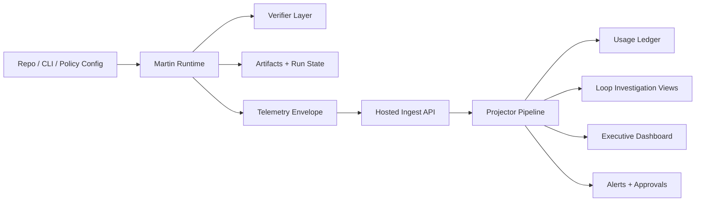
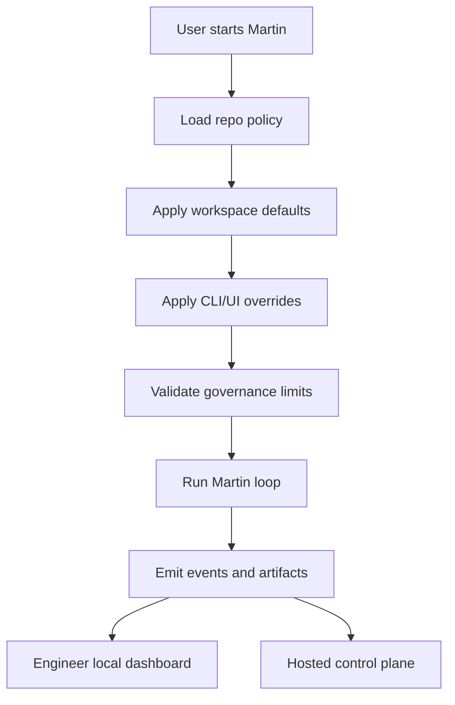

# Martin Loop V2/V3 Product Spec

## Why Martin Exists

Martin Loop is meant to solve two linked problems:

1. Ralph-style autonomous loops waste tokens, time, and engineering attention because they often keep retrying without converging on a verified answer.
2. Companies are spending aggressively on AI coding and agent workflows without a clear way for CTOs and CFOs to measure whether the spend is producing reliable output or defensible ROI.

That framing is directionally correct. I would add a third requirement:

3. Teams need a secure and trusted operating model, or they will not allow autonomous loops to scale in production.

Recent reporting reinforces the urgency of the problem. Business Insider reported on March 7, 2026 that Chamath Palihapitiya said his startup’s AI costs had more than tripled since November 2025 and specifically criticized “Ralph Wiggum loops” as producing massive bills while “never figures anything out.”  
Source: [Business Insider](https://www.businessinsider.com/chamath-palihapitiya-ai-costs-tokens-8090-2026-3)

## Product Thesis

Martin should become:

- the runtime that prevents wasteful autonomous coding loops
- the control plane that makes AI engineering activity legible to executives
- the governance layer where teams define cost, token, iteration, and safety limits before a loop runs

Martin is not just “another coding agent wrapper.” It is an operational system for controlled autonomous work.

## Board Synthesis

### Runtime / CTO lens

- Martin must prove verified solve-rate under budget on real tasks.
- It needs real adapters, strict verification boundaries, persistence, and resumability.
- It must be explainable through loop state, artifacts, event history, and benchmark evidence.

### CFO / finance lens

- Savings claims are not credible without a ledger and methodology.
- The dashboard must distinguish actual spend, forecast, committed spend, prevented spend, and confidence.
- Billing, alerts, approvals, and auditability matter more than pretty metrics.

### Engineering / adoption lens

- Engineers need a fast local validation path.
- A seeded demo workspace is necessary for trust and onboarding.
- The local dashboard and hosted dashboard must share the same underlying story and data model.

## Product Surfaces

Martin should have three distinct surfaces.

### 1. Runtime surface

This is the engine that runs coding loops.

- CLI-first
- provider-agnostic
- verifier-driven
- budget-governed
- resumable

### 2. Local engineer dashboard

This is for the person actually running Martin in Codex, Claude Code, Gemini CLI, or a repo-local setup.

Purpose:

- show active attempt history
- show current budget burn
- show verifier status
- show intervention decisions
- show why Martin exited or escalated

This dashboard should be optimized for debugging and operations, not finance polish.

### 3. Hosted SaaS control plane

This is for executives, operators, CTOs, CFOs, and engineering leaders.

Purpose:

- show AI spend and savings across teams
- show policies, governance, alerts, and approvals
- show loop health and investigation data
- show billing, forecasts, and ROI confidence

## Governance Inputs

Martin needs a clear place where users define loop governance before autonomous execution starts.

These controls should exist in both CLI/config and UI form.

### CLI / repo-local governance input

Governance should be accepted in three ways:

1. `martin.config.yaml` in the repo
2. CLI flags for overrides
3. preset policy profiles such as `strict`, `balanced`, `overnight`, `debug`

The minimum controls are:

- max USD budget
- soft USD budget
- max iterations
- max total tokens
- allowed adapter set
- allowed model set
- destructive action policy
- verifier requirements
- escalation behavior
- telemetry destination

### Hosted UI governance input

Governance should be configurable at:

- organization level
- workspace level
- project level
- single-run override level

The hosted control plane should make it obvious which level is currently active and which policy won.

## Security Model

Security has to be part of V2, not deferred until “enterprise.”

### Runtime security requirements

- explicit allowlist for shell actions and risky file mutations
- approval gates for destructive commands
- separation between generation and verification
- artifact capture without leaking secrets
- local credential use only through explicit adapter boundaries

### Control-plane security requirements

- workspace and project scoping
- signed telemetry ingest with key rotation
- role-based access control
- policy change audit log
- immutable usage ledger
- data retention controls
- artifact and trace access controls

### Executive trust requirements

- prevented spend is always labeled as modeled or estimated
- savings methodology is visible
- confidence bands exist before CFO-facing rollups are treated as truth

## Dashboard Redesign

The current hosted dashboard is a useful scaffold but not yet clean enough.

The redesign should split responsibilities by persona.

### Executive overview

Audience:

- CFO
- CTO
- CEO

Must answer:

- how much did we spend
- how much waste did Martin prevent
- where is budget drift happening
- which teams are getting ROI
- what needs approval or intervention now

### Engineering leader view

Audience:

- VP Engineering
- Head of AI platform
- EMs

Must answer:

- which loops are failing repeatedly
- which adapters or models are wasteful
- where verification is failing
- which teams need policy tuning

### Engineer operator view

Audience:

- individual engineers
- agent operators

Must answer:

- what is Martin doing right now
- why did it stop
- what verifier failed
- what intervention was chosen
- what can I replay or resume

## Information Architecture

### Hosted control-plane navigation

- Overview
- Loops
- Savings
- Ledger
- Alerts
- Policies
- Approvals
- Integrations
- Billing
- Settings

### Local engineer dashboard navigation

- Current Run
- Attempt Timeline
- Budget Monitor
- Verifier Output
- Interventions
- Artifacts
- Replay / Resume

## V2 Plan

V2 should be split into three deliberate sub-phases.

### V2A: Demo + onboarding + trust

Goal:

Make Martin understandable, inspectable, and easy to validate quickly.

Includes:

- guided first-run onboarding
- seeded end-to-end demo workspace
- clean local engineer dashboard
- refreshed hosted dashboard visuals
- one-command validation lane
- visual demo pack and screenshots
- repo cleanup for public GitHub release

### V2B: Runtime hardening

Goal:

Make Martin actually more effective than Ralph-style looping.

Includes:

- real adapter and verifier pipeline
- persistent run state and resumability
- predictive budget governor
- adaptive intervention policy
- real benchmark harness
- simulation harness for edge cases

### V2C: SaaS data foundation

Goal:

Turn the hosted dashboard into a real control plane rather than a mock shell.

Includes:

- contract-aligned telemetry ingest
- projector pipeline
- usage ledger
- loop investigation view
- billing and savings reconciliation
- alerts and approvals foundation

## V3 Plan

V3 should add higher-order intelligence and enterprise readiness.

### Runtime V3

- portfolio memory
- dynamic model routing
- multi-step subloop decomposition
- approval-aware risky actions
- offline-first telemetry delivery hardening

### Control-plane V3

- forecasting and anomaly detection
- chargeback and showback
- savings confidence framework
- policy simulation / policy-as-code
- enterprise integrations
- RBAC hardening and audit maturity

## Testing Strategy

The build must be tested piece by piece.

### Principle

- build one slice
- test one slice
- fix it
- only then move to the next slice

### Required test layers

- unit tests for contracts, policies, and budget logic
- integration tests for adapters and telemetry ingestion
- end-to-end demo tests for the seeded workspace
- dashboard correctness tests for finance rollups
- security tests for policy boundaries and tenant isolation
- simulation tests for worst-case loop behavior

## Monte Carlo And Scenario Simulation

Martin needs simulation, not just happy-path tests.

### Simulation families

- repeated logic failure loops
- repeated environment mismatch loops
- verification false-positive / false-negative scenarios
- runaway high-token scenarios
- cheap-model / expensive-model routing scenarios
- telemetry delivery loss / reorder / duplication
- policy misconfiguration scenarios
- multi-team budget contention

The output should be visible in both engineering and executive form:

- engineer view: trace-level evidence
- executive view: scenario risk and cost impact

## Visual Demo Pack

The repo should ship with reusable visuals.

### Required image outputs

- hosted dashboard screenshots
- local dashboard screenshots
- Ralph vs Martin comparison board
- runtime loop lifecycle diagram
- telemetry-to-control-plane diagram
- governance input flow diagram
- one-page product screenshot montage

## Business Collateral Refresh

The original Martin collateral should be refreshed to match the new product reality.

### Refresh set

- pitch deck
- business plan
- one-pager
- financial model

### Required changes

- stop using unsupported savings claims
- tie the business model to measurable ROI and governance
- show the dual-surface story: runtime + control plane
- show security and executive trust as differentiators
- update the ICP toward CTO/CFO tension around AI spend

## Public Repo Shape

The GitHub repo should feel clean and legible to both humans and models.

### Repository standards

- one clear root README
- architecture docs near the root
- examples folder for policies and demo runs
- screenshots folder for visual assets
- benchmark fixtures and outputs in a predictable place
- CLI/config examples up front
- no duplicate runtime entrypoints

Martin should feel as easy to ingest as Ralphy, but more structured and more explicit about governance and outcomes.

## Success Metrics

Martin V2 is successful if:

- it demonstrably exits bad loops faster than a Ralph baseline
- it shows governance inputs clearly before a run starts
- engineers can inspect a run locally without confusion
- the hosted dashboard can explain spend and savings credibly
- the demo path convinces a new user in under 5 minutes

Martin V3 is successful if:

- finance trusts the billing and savings model
- engineering leaders trust the benchmark evidence
- operators trust policies, alerts, and approvals
- security and tenancy are strong enough for real production rollout

## Architecture Diagram

## Governance Input Flow

## Recommendation

Do not jump straight into “build all of V3.”

The next correct implementation sequence is:

1. V2A demo/onboarding/dashboard cleanup
2. V2B runtime hardening
3. V2C SaaS data foundation
4. V3 governance, forecasting, and enterprise scale

