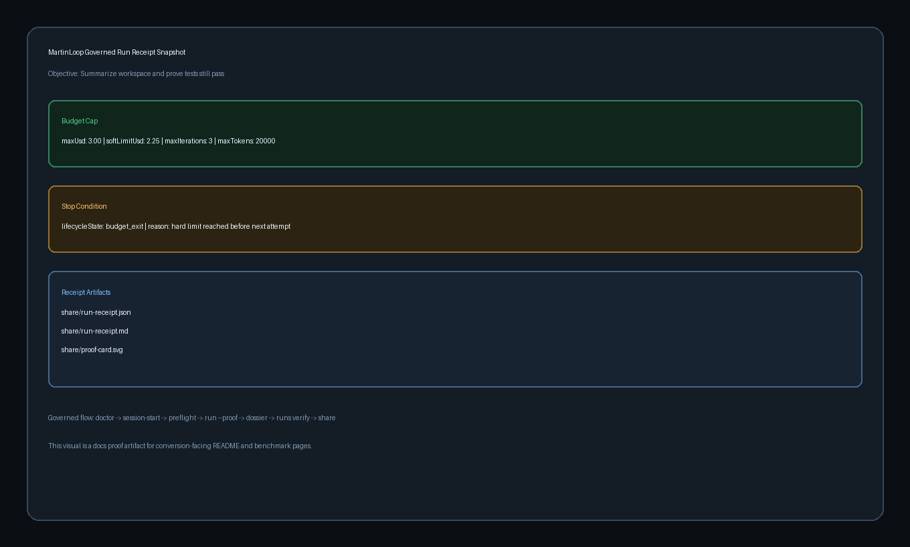

# Benchmark + Receipt Page

This page is the clean, reproducible path to one benchmark result and one live governed receipt bundle.

## Goal

Prove four things in one pass:

1. Budget caps are active.
2. Stop conditions are explicit.
3. A real verifier decides whether the outcome is acceptable.
4. Receipt artifacts are generated for review.

## Quick benchmark lane

```sh
npx -y martin-loop@latest bench --suite under-3-challenge
```

For repo-local deterministic execution:

```sh
pnpm install --frozen-lockfile
pnpm --filter @martin/benchmarks build
pnpm --filter @martin/benchmarks test
pnpm --filter @martin/benchmarks eval
pnpm --filter @martin/benchmarks report:ralphy
```

## Live governed receipt lane

Do not use `--proof` for external demos. `--proof` is intentionally a no-spend adapter lane and should not be presented as evidence of a live coding-agent execution.

Start in a disposable demo workspace:

```sh
npx -y martin-loop@latest start
npx -y martin-loop@latest demo
cd martin-loop-demo
npm install
```

Run a real installed adapter with an explicit budget and verifier:

```sh
npx -y martin-loop@latest run \
  "Summarize the demo workspace and prove tests still pass" \
  --verify "npm test" \
  --budget-usd 3 \
  --max-iterations 1
```

Then verify and export the evidence:

```sh
npx -y martin-loop@latest dossier --latest
npx -y martin-loop@latest runs verify --latest
npx -y martin-loop@latest share --latest --with-proof-card --proof-card-format both
```

Default receipt bundle outputs:

- `share/run-receipt.json`
- `share/run-receipt.md`

Optional proof-card outputs:

- `share/proof-card-r<revision>-<hash>.svg`
- `share/proof-card-r<revision>-<hash>.png`

## Current public proof anchor

The repository includes a real governed receipt that records:

- `$0.51` spend against a `$3.00` budget
- one attempt
- a passing verifier
- signed receipt integrity
- an explicit `EVIDENCE_BOUNDARY` because rollback evidence was not recorded

That boundary is part of the proof. Do not rewrite it as a fully verified or rollback-proven run.

- [Live governed receipt — Markdown](../examples/proof-receipts/live-governed-run-receipt.md)
- [Live governed receipt — JSON](../examples/proof-receipts/live-governed-run-receipt.json)
- [Live governed proof image](../assets/proof-receipt-live-governed.png)

## Screenshot: budget cap, stop condition, receipt



Use the live receipt and screenshot as the proof anchors in demos and external walkthroughs. Use the creator-specific run receipt whenever a creator completes the experiment themselves.

## Related docs

- [MartinLoop Creator Lab](../creator-lab/README.md)
- [Creator experiments](../creator-lab/EXPERIMENTS.md)
- [Claims and disclosure rules](../creator-lab/CLAIMS-AND-DISCLOSURES.md)
- [Agent run receipts](./AGENT-RUN-RECEIPTS.md)
- [Budget caps](../concepts/budget-caps.md)
