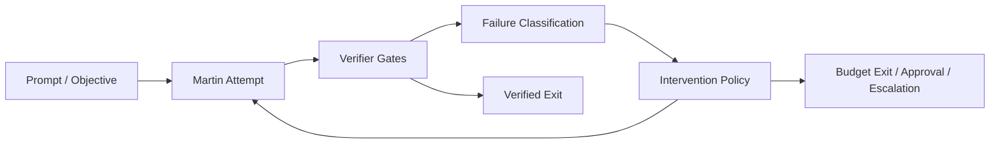
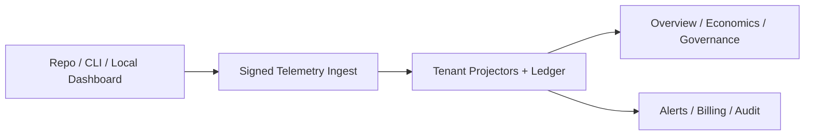

# Martin Loop V2A Trust + Demo Implementation Plan

> **For agentic workers:** REQUIRED SUB-SKILL: Use superpowers:subagent-driven-development (recommended) or superpowers:executing-plans to implement this plan task-by-task. Steps use checkbox (`- [ ]`) syntax for tracking.

**Goal:** Ship the first trust-first Martin Loop product slice by separating executive and operator surfaces, making governance inputs explicit, aligning both dashboards around one seeded demo story, and generating honest visual/demo assets for GitHub, stakeholders, and product reviews.

**Architecture:** Keep the current monorepo structure. Refactor the hosted Next.js control plane into an executive-first IA, refactor the static local dashboard into an operator-first IA, and introduce one canonical seeded demo scenario that feeds both surfaces plus the comparison/visual story. Add lightweight CLI/config affordances for governance provenance so the UI story maps to real runtime concepts.

**Tech Stack:** TypeScript, Next.js app router, React, Vitest, static HTML/CSS/JS for the local dashboard, Playwright for screenshots, Markdown + Mermaid + SVG/PNG asset export for docs.

---

## File Structure Map

### Hosted control plane

- Modify: `apps/control-plane/app/page.tsx`
- Create: `apps/control-plane/app/operations/page.tsx`
- Create: `apps/control-plane/app/economics/page.tsx`
- Create: `apps/control-plane/app/governance/page.tsx`
- Modify: `apps/control-plane/app/globals.css`
- Modify: `apps/control-plane/components/control-plane-shell.tsx`
- Create: `apps/control-plane/components/overview-kpi-band.tsx`
- Create: `apps/control-plane/components/trust-strip.tsx`
- Create: `apps/control-plane/components/exception-panel.tsx`
- Create: `apps/control-plane/components/primary-trend-panel.tsx`
- Modify: `apps/control-plane/components/dashboard-primitives.tsx`
- Modify: `apps/control-plane/lib/queries/control-plane-queries.ts`
- Modify: `apps/control-plane/lib/data/mock-control-plane-data.ts`
- Create: `apps/control-plane/lib/view-models/executive-overview.ts`
- Create: `apps/control-plane/lib/view-models/operator-economics.ts`
- Test: `apps/control-plane/tests/control-plane-queries.test.ts`
- Test: `apps/control-plane/tests/control-plane-routes.test.ts`

### Local operator dashboard

- Modify: `apps/local-dashboard/index.html`
- Modify: `apps/local-dashboard/styles.css`
- Modify: `apps/local-dashboard/app.js`
- Modify: `apps/local-dashboard/data/demo-data.js`
- Create: `apps/local-dashboard/README.md`
- Create: `apps/local-dashboard/tests/local-dashboard-data.test.ts`

### Governance input and demo-story contract

- Create: `demo/seeded-workspace/seeded-run.json`
- Create: `demo/seeded-workspace/ralph-vs-martin.json`
- Create: `demo/seeded-workspace/governance-policy.json`
- Create: `scripts/build-demo-assets.mjs`
- Create: `packages/contracts/src/governance.ts`
- Modify: `packages/contracts/src/index.ts`
- Modify: `packages/cli/src/index.ts`
- Test: `packages/contracts/tests/governance.test.ts`
- Test: `packages/cli/tests/cli.test.ts`
- Create: `martin.config.example.yaml`
- Create: `docs/guides/run-guardrails.md`

### Visual/demo/documentation assets

- Create: `docs/demo/martin-demo-script.md`
- Create: `docs/demo/visual-asset-checklist.md`
- Create: `docs/demo/diagrams/runtime-lifecycle.mmd`
- Create: `docs/demo/diagrams/telemetry-flow.mmd`
- Create: `docs/demo/diagrams/savings-methodology.mmd`
- Create: `docs/demo/screenshots/README.md`
- Create: `docs/demo/screenshots/manifest.json`
- Create: `docs/oss/README-outline.md`

### Validation and polish

- Modify: `OPEN-ME-FIRST.html`
- Modify: `docs/testing/non-technical-testing-guide.md`
- Modify: `docs/testing/non-technical-testing-guide.html`
- Modify: `deploy/DEPLOYMENT-GUIDE.md`

## Shared Definitions For This Plan

### Executive overview navigation

```ts
export const EXECUTIVE_NAV = [
  { label: "Overview", href: "/" },
  { label: "Operations", href: "/operations" },
  { label: "Economics", href: "/economics" },
  { label: "Governance", href: "/governance" },
  { label: "Billing", href: "/billing" },
  { label: "Admin", href: "/settings" }
];
```

### Local operator navigation

```ts
export const LOCAL_OPERATOR_SECTIONS = [
  "Current Run",
  "Timeline",
  "Budget",
  "Verifier",
  "Interventions",
  "Artifacts",
  "Replay / Resume",
  "Benchmark Lab"
];
```

### Governance snapshot contract

```ts
export type GovernanceSnapshot = {
  policyProfile: "strict" | "balanced" | "overnight" | "debug";
  maxUsd: number;
  softLimitUsd: number;
  maxTokens: number;
  maxIterations: number;
  allowedAdapters: string[];
  allowedModels: string[];
  destructiveActionPolicy: "never" | "approval" | "allowed";
  approvalRequired: boolean;
  verifierRules: string[];
  escalationRoute: string;
  telemetryDestination: "local-only" | "control-plane";
  retentionPolicy: string;
  provenance: Array<{ field: string; value: string; source: string }>;
};
```

## Task 1: Lock The Seeded Demo Contract

**Files:**
- Create: `demo/seeded-workspace/seeded-run.json`
- Create: `demo/seeded-workspace/ralph-vs-martin.json`
- Create: `demo/seeded-workspace/governance-policy.json`
- Create: `packages/contracts/src/governance.ts`
- Modify: `packages/contracts/src/index.ts`
- Test: `packages/contracts/tests/governance.test.ts`

- [ ] **Step 1: Write the failing contract test**

```ts
import { describe, expect, it } from "vitest";
import { createGovernanceSnapshot, type GovernanceSnapshot } from "../src/governance.js";

describe("createGovernanceSnapshot", () => {
  it("preserves provenance for every governed field", () => {
    const snapshot = createGovernanceSnapshot({
      policyProfile: "balanced",
      maxUsd: 8,
      softLimitUsd: 5,
      maxTokens: 20_000,
      maxIterations: 3,
      allowedAdapters: ["direct:openai", "agent:codex"],
      allowedModels: ["gpt-5.4-mini"],
      destructiveActionPolicy: "approval",
      approvalRequired: true,
      verifierRules: ["pnpm test", "pnpm lint"],
      escalationRoute: "Slack #martin-approvals",
      telemetryDestination: "control-plane",
      retentionPolicy: "30 days",
      provenance: [
        { field: "maxUsd", value: "8", source: "workspace-policy" },
        { field: "softLimitUsd", value: "5", source: "run-flag" }
      ]
    } satisfies GovernanceSnapshot);

    expect(snapshot.provenance).toContainEqual({
      field: "maxUsd",
      value: "8",
      source: "workspace-policy"
    });
    expect(snapshot.telemetryDestination).toBe("control-plane");
  });
});
```

- [ ] **Step 2: Run the contract test to verify it fails**

Run: `pnpm exec vitest run packages/contracts/tests/governance.test.ts`

Expected: FAIL with module or export errors for `governance.ts`.

- [ ] **Step 3: Add the governance contract**

```ts
export type GovernanceSnapshot = {
  policyProfile: "strict" | "balanced" | "overnight" | "debug";
  maxUsd: number;
  softLimitUsd: number;
  maxTokens: number;
  maxIterations: number;
  allowedAdapters: string[];
  allowedModels: string[];
  destructiveActionPolicy: "never" | "approval" | "allowed";
  approvalRequired: boolean;
  verifierRules: string[];
  escalationRoute: string;
  telemetryDestination: "local-only" | "control-plane";
  retentionPolicy: string;
  provenance: Array<{ field: string; value: string; source: string }>;
};

export function createGovernanceSnapshot(snapshot: GovernanceSnapshot): GovernanceSnapshot {
  return {
    ...snapshot,
    provenance: [...snapshot.provenance]
  };
}
```

- [ ] **Step 4: Add the seeded demo JSON files**

```json
{
  "loopId": "loop_demo_001",
  "title": "Repair flaky CI gate",
  "status": "budget_exit",
  "actualSpendUsd": 2.3,
  "modeledAvoidedSpendUsd": 6.1,
  "confidence": "medium",
  "verifierSummary": "pnpm test passed after dependency lockfile repair",
  "seedLabel": "Seeded Demo Data"
}
```

```json
{
  "scenarioId": "ralph-vs-martin-flaky-ci",
  "ralph": {
    "attempts": 5,
    "spendUsd": 8.4,
    "result": "not_verified"
  },
  "martin": {
    "attempts": 2,
    "spendUsd": 2.3,
    "result": "verified_pass"
  },
  "seedLabel": "Simulated Scenario"
}
```

```json
{
  "policyProfile": "balanced",
  "maxUsd": 8,
  "softLimitUsd": 5,
  "maxTokens": 20000,
  "maxIterations": 3,
  "allowedAdapters": ["direct:openai", "agent:codex"],
  "allowedModels": ["gpt-5.4-mini"],
  "destructiveActionPolicy": "approval",
  "approvalRequired": true,
  "verifierRules": ["pnpm test", "pnpm lint"],
  "escalationRoute": "Slack #martin-approvals",
  "telemetryDestination": "control-plane",
  "retentionPolicy": "30 days",
  "provenance": [
    { "field": "maxUsd", "value": "8", "source": "workspace-policy" },
    { "field": "softLimitUsd", "value": "5", "source": "run-flag" }
  ]
}
```

- [ ] **Step 5: Export the new contract and rerun tests**

Run: `pnpm exec vitest run packages/contracts/tests/governance.test.ts packages/contracts/tests/telemetry-envelope.test.ts`

Expected: PASS for the new governance test and no regressions in existing contract tests.

- [ ] **Step 6: Commit**

```bash
git add demo/seeded-workspace packages/contracts/src packages/contracts/tests
git commit -m "feat: add seeded governance and demo contracts"
```

## Task 2: Rebuild Hosted Control-Plane Information Architecture

**Files:**
- Modify: `apps/control-plane/components/control-plane-shell.tsx`
- Modify: `apps/control-plane/app/page.tsx`
- Create: `apps/control-plane/app/operations/page.tsx`
- Create: `apps/control-plane/app/economics/page.tsx`
- Create: `apps/control-plane/app/governance/page.tsx`
- Create: `apps/control-plane/components/overview-kpi-band.tsx`
- Create: `apps/control-plane/components/trust-strip.tsx`
- Create: `apps/control-plane/components/exception-panel.tsx`
- Create: `apps/control-plane/components/primary-trend-panel.tsx`
- Modify: `apps/control-plane/components/dashboard-primitives.tsx`
- Modify: `apps/control-plane/lib/queries/control-plane-queries.ts`
- Create: `apps/control-plane/lib/view-models/executive-overview.ts`
- Create: `apps/control-plane/lib/view-models/operator-economics.ts`
- Test: `apps/control-plane/tests/control-plane-queries.test.ts`
- Test: `apps/control-plane/tests/control-plane-routes.test.ts`

- [ ] **Step 1: Write failing query tests for the new IA**

```ts
import { describe, expect, it } from "vitest";
import { buildExecutiveOverviewViewModel } from "../lib/view-models/executive-overview.js";
import { getNavigationItems, getOverviewPageData } from "../lib/queries/control-plane-queries.js";
import * as controlPlaneQueries from "../lib/queries/control-plane-queries.js";

describe("control plane IA", () => {
  it("uses the executive-first navigation order", () => {
    expect(getNavigationItems().map((item) => item.label)).toEqual([
      "Overview",
      "Operations",
      "Economics",
      "Governance",
      "Billing",
      "Admin"
    ]);
  });

  it("returns overview data with actual, forecast, modeled, and confidence fields", () => {
    const overview = getOverviewPageData();

    expect(overview.kpiBand.map((item) => item.label)).toEqual([
      "Actual AI Spend",
      "Month-End Forecast",
      "Modeled Avoided Spend",
      "Verified Solve Rate"
    ]);
    expect(overview.trustStrip.some((item) => item.label === "Telemetry Coverage")).toBe(true);
  });

  it("routes overview composition through the executive view-model and retires legacy exports", () => {
    expect(getOverviewPageData()).toEqual(buildExecutiveOverviewViewModel());
    expect((controlPlaneQueries as Record<string, unknown>).getLoopsPageData).toBeUndefined();
    expect((controlPlaneQueries as Record<string, unknown>).getSavingsPageData).toBeUndefined();
    expect((controlPlaneQueries as Record<string, unknown>).getPoliciesPageData).toBeUndefined();
    expect((controlPlaneQueries as Record<string, unknown>).getIntegrationsPageData).toBeUndefined();
  });
});
```

- [ ] **Step 2: Run the hosted query tests to verify they fail**

Run: `pnpm exec vitest run apps/control-plane/tests/control-plane-queries.test.ts apps/control-plane/tests/control-plane-routes.test.ts`

Expected: FAIL because the old nav labels and overview shape do not match the new contract.

- [ ] **Step 3: Refactor the query layer and view models**

```ts
import { buildExecutiveOverviewViewModel } from "../view-models/executive-overview.js";
import { buildEconomicsViewModel } from "../view-models/operator-economics.js";

export function getNavigationItems() {
  return [
    { label: "Overview", href: "/" },
    { label: "Operations", href: "/operations" },
    { label: "Economics", href: "/economics" },
    { label: "Governance", href: "/governance" },
    { label: "Billing", href: "/billing" },
    { label: "Admin", href: "/settings" }
  ];
}

export function getOverviewPageData() {
  return buildExecutiveOverviewViewModel();
}

export function getEconomicsPageData() {
  return buildEconomicsViewModel();
}
```

Also remove the legacy hosted route/query surface so the hosted app only ships:

- `Overview`
- `Operations`
- `Economics`
- `Governance`
- `Billing`
- `Admin`

- [ ] **Step 4: Replace the hero-card layout with KPI band + trust strip + dominant chart + exception panel**

```tsx
<ControlPlaneShell title="Overview" eyebrow="Executive control room">
  <ExecutiveContextBar
    workspaceLabel={overview.executiveContext.workspaceLabel}
    reportingWindow={overview.executiveContext.reportingWindow}
    policyProfile={overview.executiveContext.policyProfile}
    labels={overview.executiveContext.labels}
  />
  <OverviewKpiBand items={overview.kpiBand} />
  <TrustStrip items={overview.trustStrip} />
  <section className="overview-primary-grid">
    <PrimaryTrendPanel
      title="Spend, forecast, and modeled avoidance"
      points={overview.primaryTrend.points}
      labels={overview.primaryTrend.labels}
    />
    <ExceptionPanel title="Exceptions" rows={overview.exceptions} />
  </section>
</ControlPlaneShell>
```

- [ ] **Step 5: Add the new route pages**

```tsx
export default function EconomicsPage() {
  const economics = getEconomicsPageData();

  return (
    <ControlPlaneShell title="Economics" eyebrow="Spend, forecast, and modeled ROI">
      <ExecutiveContextBar
        workspaceLabel={economics.executiveContext.workspaceLabel}
        reportingWindow={economics.executiveContext.reportingWindow}
        policyProfile={economics.executiveContext.policyProfile}
        labels={economics.executiveContext.labels}
      />
      <OverviewKpiBand items={economics.kpiBand} />
      <PrimaryTrendPanel
        title="Spend, forecast, and modeled avoidance"
        points={economics.primaryTrend.points}
        labels={economics.primaryTrend.labels}
      />
      <Panel title="Methodology notes">
        <div className="plain-list">
          {economics.methodologyNotes.map((note) => (
            <article key={note} className="table-row">
              <p className="table-cell-muted">{note}</p>
            </article>
          ))}
        </div>
      </Panel>
    </ControlPlaneShell>
  );
}
```

- [ ] **Step 6: Run hosted tests again and verify the routes/query layer pass**

Run: `pnpm exec vitest run apps/control-plane/tests/control-plane-queries.test.ts apps/control-plane/tests/control-plane-routes.test.ts`

Expected: PASS with new IA labels and overview structure.

- [ ] **Step 7: Commit**

```bash
git add apps/control-plane
git commit -m "feat: redesign hosted control-plane information architecture"
```

## Task 3: Refactor The Local Dashboard Into An Operator Console

**Files:**
- Modify: `apps/local-dashboard/index.html`
- Modify: `apps/local-dashboard/styles.css`
- Modify: `apps/local-dashboard/app.js`
- Modify: `apps/local-dashboard/data/demo-data.js`
- Create: `apps/local-dashboard/tests/local-dashboard-data.test.ts`
- Create: `apps/local-dashboard/README.md`

- [ ] **Step 1: Write a failing local-dashboard data contract test**

```ts
import { describe, expect, it } from "vitest";
import { operatorDemoData } from "../data/demo-data.js";

describe("local operator dashboard data", () => {
  it("surfaces run state, budget, verifier, and effective policy", () => {
    expect(operatorDemoData.currentRun.title).toBeTruthy();
    expect(operatorDemoData.budget.softLimitUsd).toBeGreaterThan(0);
    expect(operatorDemoData.verifier.lastGate.label).toBe("pnpm test");
    expect(operatorDemoData.effectivePolicy.provenance.length).toBeGreaterThan(0);
  });
});
```

- [ ] **Step 2: Run the local-dashboard test to verify it fails**

Run: `pnpm exec vitest run apps/local-dashboard/tests/local-dashboard-data.test.ts`

Expected: FAIL because the current seeded data is overview-heavy and does not expose operator-first sections.

- [ ] **Step 3: Rewrite the local dashboard markup around operator sections**

```html
<nav>
  <a href="#current-run">Current Run</a>
  <a href="#timeline">Timeline</a>
  <a href="#budget">Budget</a>
  <a href="#verifier">Verifier</a>
  <a href="#interventions">Interventions</a>
  <a href="#artifacts">Artifacts</a>
  <a href="#replay">Replay / Resume</a>
  <a href="#benchmark-lab">Benchmark Lab</a>
</nav>
```

- [ ] **Step 4: Replace overview-first demo data with operator-first seeded data**

```js
window.operatorDemoData = {
  seedLabel: "Seeded Demo Data",
  currentRun: {
    title: "Repair flaky CI gate",
    repo: "martin-loop",
    adapter: "direct:openai",
    model: "gpt-5.4-mini",
    state: "attempt_running",
    attempt: 2,
    elapsed: "00:02:14"
  },
  budget: {
    hardLimitUsd: 8,
    softLimitUsd: 5,
    spentUsd: 2.3,
    tokensUsed: 12840,
    iterationsUsed: 2,
    projectedExit: "$3.20 if burn rate holds"
  },
  verifier: {
    lastGate: { label: "pnpm test", status: "passed" },
    trend: ["failed", "passed"]
  }
};
```

- [ ] **Step 5: Implement sections for current run, budget, verifier, interventions, artifacts, replay, and benchmark lab**

```js
document.querySelector("#current-run").innerHTML = renderCurrentRun(data.currentRun, data.effectivePolicy);
document.querySelector("#budget").innerHTML = renderBudgetPanel(data.budget);
document.querySelector("#verifier").innerHTML = renderVerifierPanel(data.verifier);
document.querySelector("#interventions").innerHTML = renderInterventions(data.interventions);
document.querySelector("#benchmark-lab").innerHTML = renderBenchmarkComparison(data.benchmarkLab);
```

- [ ] **Step 6: Run the local-dashboard test again**

Run: `pnpm exec vitest run apps/local-dashboard/tests/local-dashboard-data.test.ts`

Expected: PASS and confirm seeded data contains operator-critical sections.

- [ ] **Step 7: Commit**

```bash
git add apps/local-dashboard
git commit -m "feat: refactor local dashboard into operator console"
```

## Task 4: Make Governance Inputs Explicit In CLI, Config, And UI

**Files:**
- Modify: `packages/cli/src/index.ts`
- Test: `packages/cli/tests/cli.test.ts`
- Create: `martin.config.example.yaml`
- Create: `docs/guides/run-guardrails.md`
- Modify: `OPEN-ME-FIRST.html`

- [ ] **Step 1: Write a failing CLI parsing test for governance controls**

```ts
import { describe, expect, it } from "vitest";
import { parseCliArguments } from "../src/index.js";

describe("CLI governance parsing", () => {
  it("accepts policy and approval-related overrides", () => {
    const parsed = parseCliArguments([
      "run",
      "--objective",
      "Repair flaky CI gate",
      "--policy",
      "balanced",
      "--budget-usd",
      "8",
      "--soft-limit-usd",
      "5",
      "--max-iterations",
      "3",
      "--max-tokens",
      "20000",
      "--telemetry",
      "control-plane"
    ]);

    expect(parsed.command).toBe("run");
    if (parsed.command === "run") {
      expect(parsed.request.budget.maxUsd).toBe(8);
      expect(parsed.request.metadata.policyProfile).toBe("balanced");
      expect(parsed.request.metadata.telemetryDestination).toBe("control-plane");
    }
  });
});
```

- [ ] **Step 2: Run the CLI test to verify it fails**

Run: `pnpm exec vitest run packages/cli/tests/cli.test.ts`

Expected: FAIL because `--policy` and `--telemetry` are not parsed today.

- [ ] **Step 3: Extend the CLI parser and output**

```ts
case "--policy":
  if (next) {
    metadata.policyProfile = next;
  }
  index += 1;
  break;
case "--telemetry":
  if (next) {
    metadata.telemetryDestination = next;
  }
  index += 1;
  break;
```

```json
{
  "effectivePolicy": {
    "policyProfile": "balanced",
    "maxUsd": 8,
    "softLimitUsd": 5,
    "maxIterations": 3,
    "maxTokens": 20000,
    "telemetryDestination": "control-plane"
  }
}
```

- [ ] **Step 4: Add the example config and operator guide**

```yaml
policyProfile: balanced
budget:
  maxUsd: 8
  softLimitUsd: 5
  maxIterations: 3
  maxTokens: 20000
governance:
  destructiveActionPolicy: approval
  telemetryDestination: control-plane
  verifierRules:
    - pnpm test
    - pnpm lint
```

- [ ] **Step 5: Update `OPEN-ME-FIRST.html` so the first-click experience explains where guardrails live**

```html
<li><strong>Set guardrails</strong>: choose max budget, token cap, iteration cap, verifier rules, and telemetry destination before launching a run.</li>
```

- [ ] **Step 6: Run the CLI tests again**

Run: `pnpm exec vitest run packages/cli/tests/cli.test.ts`

Expected: PASS and show the new governance metadata in parsed output.

- [ ] **Step 7: Commit**

```bash
git add packages/cli martin.config.example.yaml docs/guides/run-guardrails.md OPEN-ME-FIRST.html
git commit -m "feat: expose governance inputs in cli and onboarding docs"
```

## Task 5: Add Honest Visual Assets And Demo Storytelling

**Files:**
- Create: `scripts/build-demo-assets.mjs`
- Create: `docs/demo/martin-demo-script.md`
- Create: `docs/demo/visual-asset-checklist.md`
- Create: `docs/demo/diagrams/runtime-lifecycle.mmd`
- Create: `docs/demo/diagrams/telemetry-flow.mmd`
- Create: `docs/demo/diagrams/savings-methodology.mmd`
- Create: `docs/demo/screenshots/README.md`
- Create: `docs/demo/screenshots/manifest.json`
- Modify: `docs/testing/non-technical-testing-guide.md`
- Modify: `docs/testing/non-technical-testing-guide.html`

- [ ] **Step 1: Write the screenshot manifest and asset checklist first**

```json
{
  "screenshots": [
    { "id": "executive-overview", "label": "Hosted executive overview", "seedLabel": "Seeded Demo Data" },
    { "id": "operator-current-run", "label": "Local operator current run", "seedLabel": "Seeded Demo Data" },
    { "id": "governance-setup", "label": "Guardrails setup", "seedLabel": "Illustrative" },
    { "id": "ralph-vs-martin-board", "label": "Comparison board", "seedLabel": "Simulated Scenario" }
  ]
}
```

- [ ] **Step 2: Add the demo script in the approved narrative order**

```md
1. Problem: Ralph-style loops spend without converging.
2. Guardrails: Show budget, token, iteration, model, and approval controls.
3. Martin in motion: Show live operator view.
4. Comparison: Show Ralph vs Martin on the seeded flaky-CI scenario.
5. Executive proof: Show actual spend, forecast, modeled avoidance, confidence, and exceptions.
```

- [ ] **Step 3: Add the Mermaid diagrams**





- [ ] **Step 4: Add the asset builder script contract**

```js
import { mkdir, writeFile } from "node:fs/promises";

const manifest = {
  generatedAt: new Date().toISOString(),
  assets: ["executive-overview", "operator-current-run", "governance-setup", "ralph-vs-martin-board"]
};

await mkdir(new URL("../docs/demo/screenshots", import.meta.url), { recursive: true });
await writeFile(
  new URL("../docs/demo/screenshots/manifest.json", import.meta.url),
  JSON.stringify(manifest, null, 2)
);
```

- [ ] **Step 5: Update the non-technical testing guide so every visual is labeled honestly**

```md
- `Seeded Demo Data` means the view is driven by prepared repo fixtures.
- `Simulated Scenario` means the comparison is modeled from a benchmark story, not live runtime execution in this environment.
- `Illustrative` means the visual demonstrates intended UX and control placement.
```

- [ ] **Step 6: Run the docs-focused smoke checks**

Run: `pnpm exec vitest run packages/contracts/tests/governance.test.ts packages/cli/tests/cli.test.ts apps/control-plane/tests/control-plane-queries.test.ts apps/local-dashboard/tests/local-dashboard-data.test.ts`

Expected: PASS for the contract, CLI, hosted query, and local data tests before screenshots are captured.

- [ ] **Step 7: Commit**

```bash
git add scripts/build-demo-assets.mjs docs/demo docs/testing
git commit -m "feat: add honest demo script diagrams and screenshot manifest"
```

## Task 6: Public Repo Polish And Deployment Readiness

**Files:**
- Create: `docs/oss/README-outline.md`
- Modify: `deploy/DEPLOYMENT-GUIDE.md`
- Modify: `apps/local-dashboard/README.md`
- Modify: `OPEN-ME-FIRST.html`

- [ ] **Step 1: Write the public README outline**

```md
# Martin Loop

- Why Martin exists
- Ralph vs Martin problem statement
- Quickstart
- Governance inputs
- Local dashboard
- Hosted control plane
- Benchmarks and honesty policy
- Screenshots
- Deployment
```

- [ ] **Step 2: Extend deployment guidance for Vercel and Netlify**

```md
## Vercel
- Deploy `apps/control-plane`
- Set workspace root to repo root
- Use `pnpm install` and `pnpm --filter @martin/control-plane build`

## Netlify
- Deploy `apps/local-dashboard`
- Publish directory: `apps/local-dashboard`
- Use the static seeded demo for no-install walkthroughs
```

- [ ] **Step 3: Update onboarding links so users can find the operator dashboard, testing guide, and deployment guide from the same first page**

```html
<a href="./apps/local-dashboard/index.html">Open operator dashboard</a>
<a href="./docs/testing/non-technical-testing-guide.html">Open testing guide</a>
<a href="./deploy/DEPLOYMENT-GUIDE.md">Open deployment guide</a>
```

- [ ] **Step 4: Run the full V2A validation lane**

Run: `pnpm exec vitest run packages/contracts/tests/governance.test.ts packages/cli/tests/cli.test.ts apps/control-plane/tests/control-plane-queries.test.ts apps/control-plane/tests/control-plane-routes.test.ts apps/local-dashboard/tests/local-dashboard-data.test.ts`

Expected: PASS across governance, CLI, hosted queries/routes, and local seeded data.

- [ ] **Step 5: Build the hosted control plane and verify the static local dashboard still opens without a build step**

Run: `pnpm build`

Expected: PASS for all packages and apps.

Manual check: open `apps/local-dashboard/index.html` directly in a browser and confirm the operator sections render without a server.

- [ ] **Step 6: Capture screenshots after successful verification**

Run:

```bash
pnpm dev:control-plane
pnpm exec playwright test docs/demo/screenshots
```

Expected:

- one hosted executive screenshot
- one hosted economics/governance screenshot
- one local operator screenshot
- one Ralph-vs-Martin comparison screenshot

- [ ] **Step 7: Commit**

```bash
git add docs/oss deploy/DEPLOYMENT-GUIDE.md OPEN-ME-FIRST.html apps/local-dashboard/README.md
git commit -m "chore: prepare v2a demo assets and deployment guidance"
```

## Self-Review

### Spec coverage

- Dashboard cleanup: covered by Tasks 2 and 3.
- Governance placement: covered by Tasks 1 and 4.
- Security/trust labeling: covered by Tasks 1, 2, 4, and 5.
- Visuals and non-technical understanding: covered by Task 5.
- Repo/public upload readiness: covered by Task 6.
- Hosted/local alignment: covered by Tasks 1 through 5.

### Placeholder scan

- No placeholder markers were left in this plan.
- Commands, file paths, and expected outputs are explicit for each task.

### Type consistency

- `GovernanceSnapshot` is defined once and reused in Tasks 1 and 4.
- Executive navigation labels match the hosted IA used in Task 2.
- Local operator sections match the run-centric dashboard structure used in Task 3.

## Post-V2A Follow-On Plans

After V2A is implemented and verified, write and execute:

1. `2026-03-27-martin-v2b-runtime-hardening-plan.md`
2. `2026-03-27-martin-v2c-control-plane-data-foundation-plan.md`
3. `2026-03-27-martin-v3-enterprise-intelligence-plan.md`
